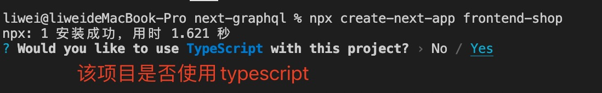
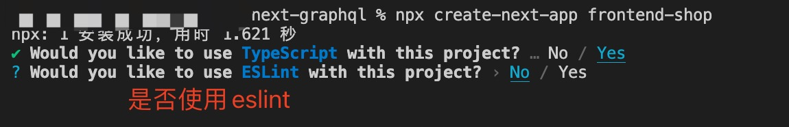
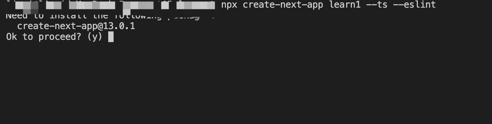
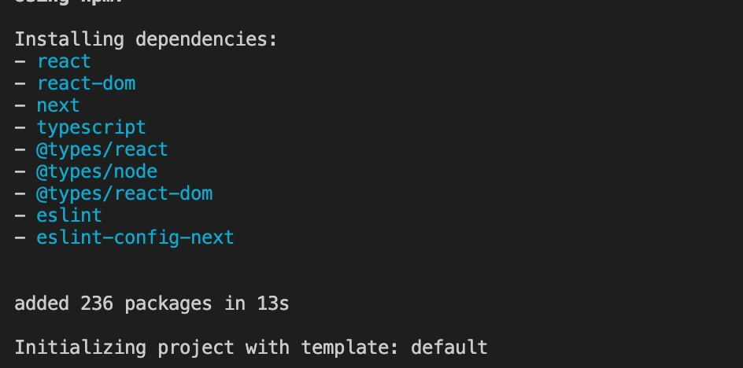

1. create-next-app 是快速创建next.js 应用的脚手架

    语法：

        npx create-next-app < projectName >

    参数:

    + -V: 当前版本号

    + --ts: 使用typescript

    + --js: 使用js

    + --eslint: 添加eslint

    + 

2. 创建基于typescript 的项目，可以根据提示来选择使用使用typescript 或者 eslint

    

    

    使用--ts 和 --eslint 创建项目

    

    