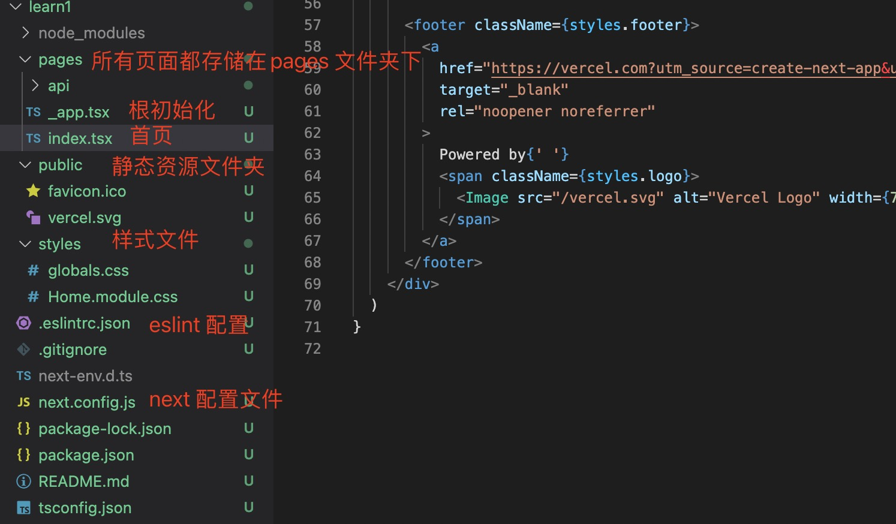
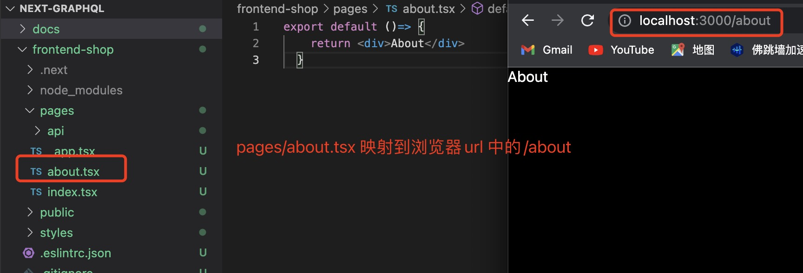
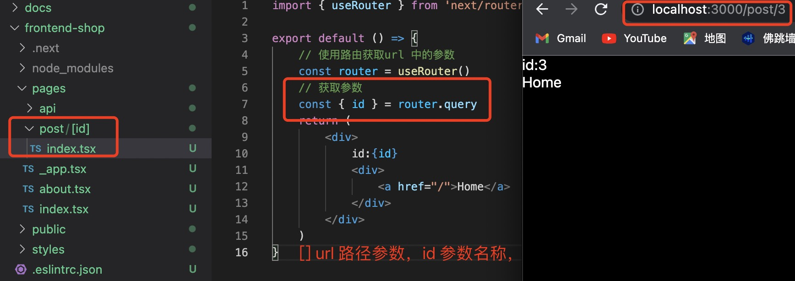
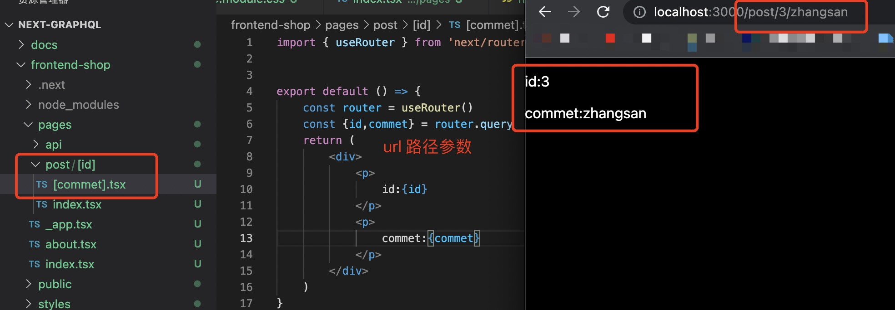
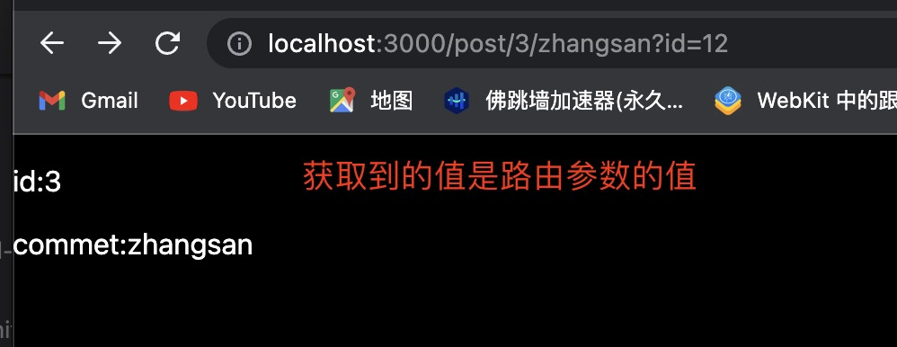

1. 生成的next 应用目录

    

2. public ：存储静态资产，例如图像、字体等。public然后您的代码可以从基本 URL ( /) 开始引用目录中的文件。

    比如：

         
            {/** image 路径 */}
            <Image src="/vercel.svg" alt="Vercel Logo" width={72} height={16} />
          

3. 应用中每一个页面都必须放到pages 中，页面对应着文件名，比如首页对应index, 新建一个about.tsx 页面，那么浏览器url 对应就是 /about

    

+ 动态页面应用

    

    > 动态参数下的动态参数：

    

    > ?param 参数：

    任何路线如/post/1,/post/abc等都将匹配pages/post/[pid].js. 
    匹配的路径参数将作为查询参数发送到页面，并与其他查询参数合并。

    同样，路由/post/abc?foo=bar将具有以下query对象：

        { "foo": "bar", "pid": "abc" }

    ***注意：?后面的参数如果和定义的参数名称相同，路由参数会覆盖掉查询参数(即？后面的参数)，比如上面的案例中参数名为pid, 那么如果？后面再跟一个pid ，？后面的pid 的值会被路由参数覆盖***

    

